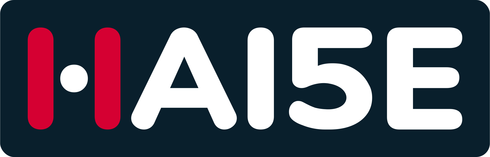

<h1 align="center">🍉 Guillermo [ Fullstack Developer ]</h1>

  <picture>
    <source media="(prefers-color-scheme: dark)" srcset="./images/hai5eLogo_darkBackground.svg">
    <source media="(prefers-color-scheme: light)" srcset="https://hai5e.com/haiseAssets/Digitales/1x/hai5eLogo_light-bg.png">
    
  </picture>

Frontend Developer with +2 years of experience, I've worked in projects with technologies such as React.js, Next.js, CSS3 and HTML5. Also, using technologies for testing as could be Cypress & Jest.

  

<h2 align="center"> Some technologies I use: </h2>

| Frontend | Backend | QA |
| -------- | ------- | -- |
| <!-- Frontend --> <!-- NextJS -->  <!-- ReactJS -->  <!-- ReactNative -->  <!-- HTML5 -->  <!-- CSS -->  <!-- Tailwind -->  <!-- Sass -->  <!-- Typescript -->  <!-- Javascript -->                                                           | <!-- BACKEND --> <!-- NestJS -->  <!-- Strapi -->  <!-- Docker -->                                                         | <!-- QA -->   <!-- Postman -->  |

| Design | Organization | Other |
| ------ | ------------ | ----- |
| <!-- AdobeXD -->                                                                          | <!-- ORGANITAZION -->  <!-- Slack -->  <!-- Notion -->  <!-- Trello -->                                                                                                            |<!-- OTHER --> <!-- Vercel -->  <!-- astro -->  <!-- Angular -->  <!-- Markdown -->  |

### 📫 Let's get in touch!

 
  <a href="https://www.linkedin.com/in/guillermo-rosales-n%C3%BA%C3%B1ez-17b1b61b9" target="_blank">
    </img>
  </a>

  <a href="https://platzi.com/p/guillermo-dfm/" target="_blank">
    </img>
  </a>

  <a href="mailto:contact@hai5e.com">
    <picture> 
      <source media="(prefers-color-scheme: dark)" srcset="https://user-images.githubusercontent.com/79668074/174081409-06cb3a24-d20b-4832-88a4-83793ab722fe.png">
      <source media="(prefers-color-scheme: light)" srcset="https://user-images.githubusercontent.com/79668074/174081409-06cb3a24-d20b-4832-88a4-83793ab722fe.png">
       
    </picture>
  </a>

<!--
**Hai5edfm/Hai5edfm** is a ✨ _special_ ✨ repository because its `README.md` (this file) appears on your GitHub profile.

Here are some ideas to get you started:

- 🔭 I’m currently working on ...
- 🌱 I’m currently learning ...
- 👯 I’m looking to collaborate on ...
- 🤔 I’m looking for help with ...
- 💬 Ask me about ...
- 📫 How to reach me: ...
- 😄 Pronouns: ...
- ⚡ Fun fact: ...
-->
